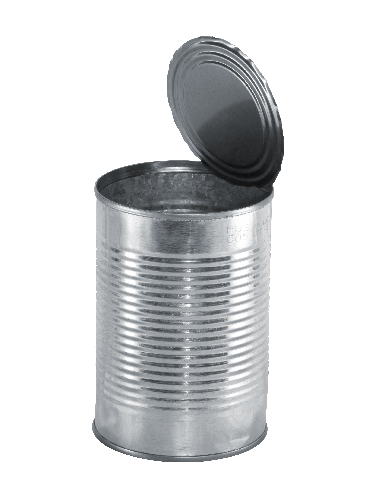

AWS can
=======



A scanner for aws resources. You can use the discovery package to get a channel of resources:

```go
import (
        "github.com/opsee/awscan"
)

scanner := awscan.NewScanner(&awscan.Config{AccessKeyId: "YOURID", SecretKey: "YOURSECRET", Region: "us-west-1"})
disco := awscan.NewDiscoverer(scanner)

for event := range disco.Discover() {
	if event.Err != nil {
		fmt.Println("whoops: ", event.Err.Error())
	} else {
		fmt.Println("yay: ", event.Result)
	}
}
```
